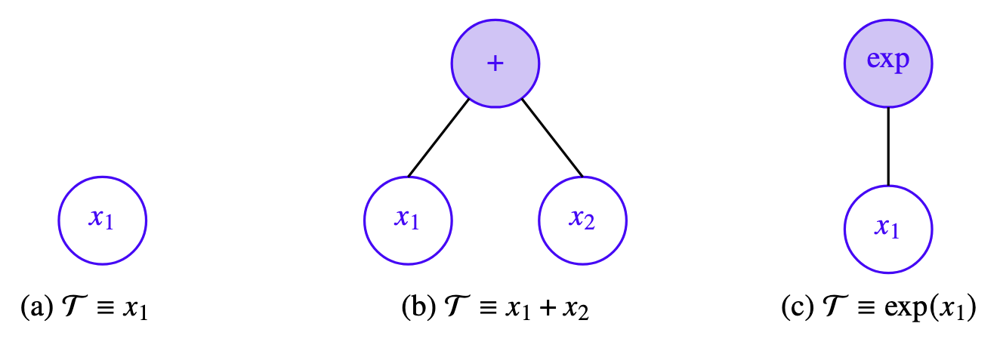
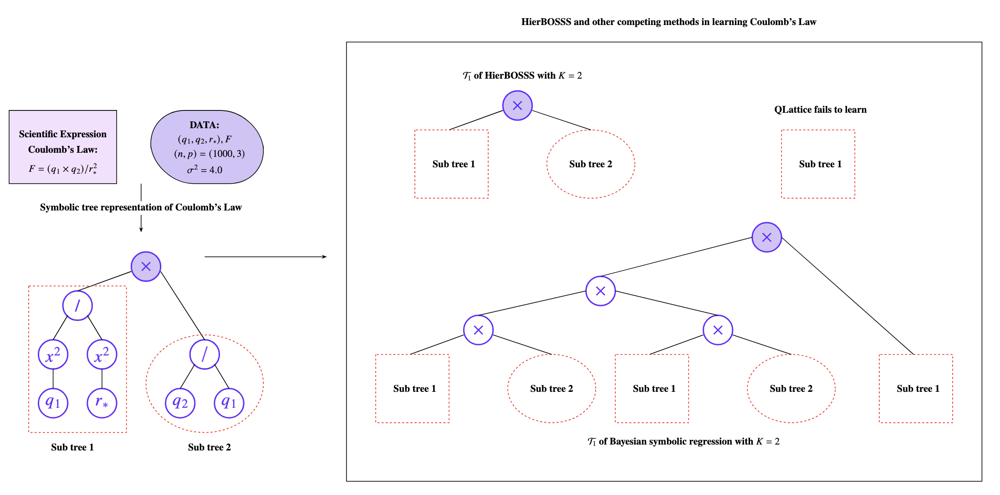

# HierBOSSS: Hierarchical Bayesian Operator-induced Symbolic Regression Trees for Structural Learning of Scientific Expressions

[](https://cran.r-project.org/)
[](https://www.python.org/)
[](./LICENSE)
[](https://github.com/Roy-SR-007/HierBOSSS/network)
[](https://github.com/Roy-SR-007/HierBOSSS)
[](https://github.com/Roy-SR-007/HierBOSSS/commits/main)
[](https://github.com/Roy-SR-007/HierBOSSS/issues)
[](https://github.com/Roy-SR-007/HierBOSSS/pulls)

<p align="center">
  
</p>

This repository holds the source code and implementation of **HierBOSSS** for Bayesian structural learning of scientific symbolic expressions proposed in Roy, S., Dey, P., Pati, D., & Mallick, B. K. (2025), *Hierarchical Bayesian Operator-induced Symbolic Regression Trees for Structural Learning of Scientific Expressions*.

---

## Developers and Maintainers

**Somjit Roy**  
Department of Statistics  
Texas A&M University, College Station, TX, USA  

📧 Email: [sroy_123@tamu.edu](mailto:sroy_123@tamu.edu)  
🌐 Website: [https://roy-sr-007.github.io](https://roy-sr-007.github.io)

**Pritam Dey**  
Department of Statistics  
Texas A&M University, College Station, TX, USA  

📧 Email: [pritam.dey@tamu.edu](mailto:pritam.dey@tamu.edu)  
🌐 Website: [https://pritamdey.github.io](https://pritamdey.github.io)

---

## NEWS

- This is the first official release of `HierBOSSS v1.0.0` on `GitHub`.
- Explore HierBOSSS' ability in Bayesian scientific machine learning for discovering and learning various scientific symbolic expressions.
- HierBOSSS has been applied for learning a suite of canonical Feynman equations and discovering important descriptors for single-atom catalysis.
- Comparisons have been presented against state-of-the-art competing symbolic regression modules.

---

## Overview

**Scientific Machine Learning** (SciML) is an interdisciplinary field that combines scientific computing with modern machine learning techniques to solve complex scientific and engineering problems ([Zhong et al., 2020](https://www.nature.com/articles/s41586-020-2242-8); [Hart et al., 2021](https://www.nature.com/articles/s41578-021-00340-w); [Zhang et al., 2025](https://www.mdpi.com/2073-4433/16/1/82); [Yang et al., 2024](https://www.sciencedirect.com/science/article/pii/S1352231024004722)). Across multidisciplinary scientific fields such as *biology* ([Boadu et al., 2025](https://analyticalsciencejournals.onlinelibrary.wiley.com/doi/abs/10.1002/pmic.202300471)), *physics* ([Udrescu and Tegmark, 2020](https://www.science.org/doi/abs/10.1126/sciadv.aay2631); [Raissi et al., 2019](https://www.sciencedirect.com/science/article/pii/S0021999118307125)), *climate science* ([Rasp et al., 2018](https://www.pnas.org/doi/abs/10.1073/pnas.1810286115)), and *materials science* ([Schmidt et al., 2019](https://www.nature.com/articles/s41524-019-0221-0)); SciML has received tremendous success for accurate and efficient problem-solving. A core challenge in the above STEM disciplines is deriving interpretable scientific formulas, which are combinations of observable physical quantities with fundamental mathematical operations. **Symbolic regression** is a powerful SciML-driven approach that automatically uncovers scientific truths by capturing (or, learning) symbolic expressions from observed data. It has been an active research area for more than two decades. Applications of symbolic regression extends to *sparse identification for nonlinear dynamical systems* ([Brunton et al., 2016](https://www.pnas.org/doi/abs/10.1073/pnas.1517384113)), *materials discovery* ([Wang et al., 2024](https://onlinelibrary.wiley.com/doi/abs/10.1002/idm2.12180)), and *learning natural scientific laws from experimental datasets* ([Schmidt and Lipson, 2009](https://www.science.org/doi/abs/10.1126/science.1165893)).

Despite the large-scale popularity of symbolic regression in learning hidden scientific mysteries, contributions to symbolic regression majorly centers around algorithmic and heuristic approaches (*genetic programming* ([Willis et al., 1997](https://ieeexplore.ieee.org/document/681044); [Davidson et al, 1999, 2003](https://doi.org/10.2166/hydro.1999.0010)), *deep symbolic regression* (DSR) ([Cranmer et al., 2020](https://proceedings.neurips.cc/paper_files/paper/2020/file/c9f2f917078bd2db12f23c3b413d9cba-Paper.pdf); [Petersen et al., 2021](https://openreview.net/forum?id=m5Qsh0kBQG)), *AI-Feynman* ([Udrescu and Tegmark, 2020](https://www.science.org/doi/abs/10.1126/sciadv.aay2631)), *QLattice* ([Brolos et al., 2021](https://arxiv.org/abs/2104.05417)), *SISSO* ([Ouyang et al., 2018](https://link.aps.org/doi/10.1103/PhysRevMaterials.2.083802)), and *iBART* ([Shengbin et al., 2024](https://doi.org/10.1080/01621459.2023.2294527))). The current literature still lacks a fully model-based framework that enables principled model selection and uncertainty quantification. To address this gap, we develop **Hier**archical **B**ayesian **O**perator-induced **S**ymbolic regression trees for **S**tructural learning of **S**cientific expressions (HierBOSSS), which advances Bayesian SciML and provides a Bayesian methodology that represents scientific symbolic expressions using symbolic trees (see Figure 1 below) within a hierarchical framework.

<figure align="center">
  
  <figcaption><em>Figure 1: Symbolic tree representation of scientific expressions.</em></figcaption>
</figure>

**HierBOSSS** models symbolic expressions through an operator-induced sum-of-symbolic trees. Conjugate priors are assigned to model regression parameters, while a regularizing prior is designed for the individual symbolic tree structures. To perform inference from the HierBOSSS-induced posterior distribution, we develop an efficient Metropolis-within-partially-collapsed Gibbs Markov chain Monte Carlo (MCMC) sampling algorithm. This GitHub repository showcases the success of HierBOSSS in discovering interpretable scientific laws. Specifically, we demonstrate HierBOSSS' ability to recover and learn well-known physics-based Feynman equations and identify meaningful descriptors in single-atom catalysis. Moreover, HierBOSSS consistently outperforms state-of-the-art symbolic regression methods (which often suffer from training data size, noise, and overly complicated symbolic expressions), offering advantages both in symbolic expression discovery and computational efficiency.

<figure align="center">
  
  <figcaption><em>Figure 2: Comparing HierBOSSS with competing symbolic regression methods in learning the Coulomb's law.</em></figcaption>
</figure>

---

## Installation and Dependencies

To get started with HierBOSSS, where the initial version (`HierBOSSS v1.0.0`) is programmed using the `R` software, clone the current GitHub repository and install the required dependencies:

* `listenv`
* `dplyr`
* `ggplot2`
* `reshape2`
* `tidyr`
* `mvtnorm`
* `scales`
* `tidyverse`
* `ggpmisc`

```bash
# using SSH on bash
git clone git@github.com:Roy-SR-007/HierBOSSS.git

# or, using HTTPS on bash
git clone https://github.com/Roy-SR-007/HierBOSSS.git
```

For running the competing methods:

1. `iBART`: is moduled on `R`, which can be installed using `install.packages('iBART')` along with the following dependencies:
- `bartMachine`
- `bartMachineJARs`
- `rJava`
- `remotes`

Check [https://github.com/mattsheng/iBART](https://github.com/mattsheng/iBART) for detailed setup instructions.

2. `BSR`: *Bayesian symbolic regression* (BSR) ([Jin et al., 2020](https://arxiv.org/abs/1910.0889)) has been built on `Python`. The folder [BSR](./BSR) contains the entire setup and experimental settings used across different applications considered.

3. `QLattice`: is available through the `Python` package `feyn`. See [https://docs.abzu.ai/](https://docs.abzu.ai/) and [QLattice](./QLattice) for detailed instructions on setup and explore the various experiments and simulations and numerics performed.

---

## Functionality and Components of the HierBOSSS Module

---

## HierBOSSS in Action

