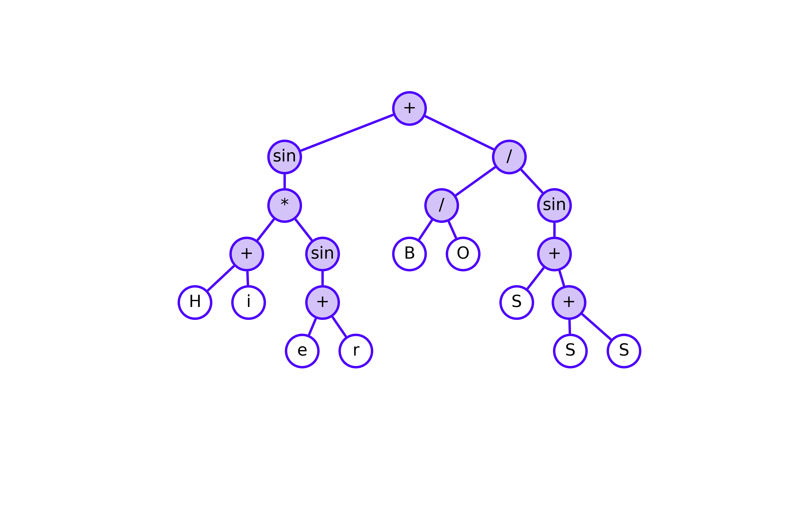

# HierBOSSS: Hierarchical Bayesian Operator-induced Symbolic Regression Trees for Structural Learning of Scientific Expressions

  

This repository holds the source code and implementation of *Hierarchical Bayesian Operator-induced Symbolic Regression Trees for Structural Learning of Scientific Expressions* (**HierBOSSS**) proposed in Roy, S., Dey, P., Pati, D., & Mallick, B. K. (2025), *Hierarchical Bayesian Operator-induced Symbolic Regression Trees for Structural Learning of Scientific Expressions*.

---

## Developers and Maintainers

**Somjit Roy**  
Department of Statistics  
Texas A&M University, College Station, TX, USA  

📧 Email: [sroy_123@tamu.edu](mailto:sroy_123@tamu.edu)  
🌐 Website: [https://roy-sr-007.github.io](https://roy-sr-007.github.io)

**Pritam Dey**  
Department of Statistics  
Texas A&M University, College Station, TX, USA  

📧 Email: [pritam.dey@tamu.edu](mailto:pritam.dey@tamu.edu)  
🌐 Website: [https://pritamdey.github.io](https://pritamdey.github.io)

---

## NEWS

- This is the first official release of `HierBOSSS v1.0.0` on `GitHub`.

---

